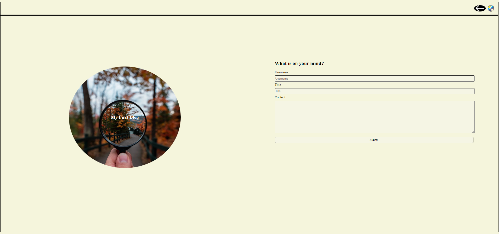
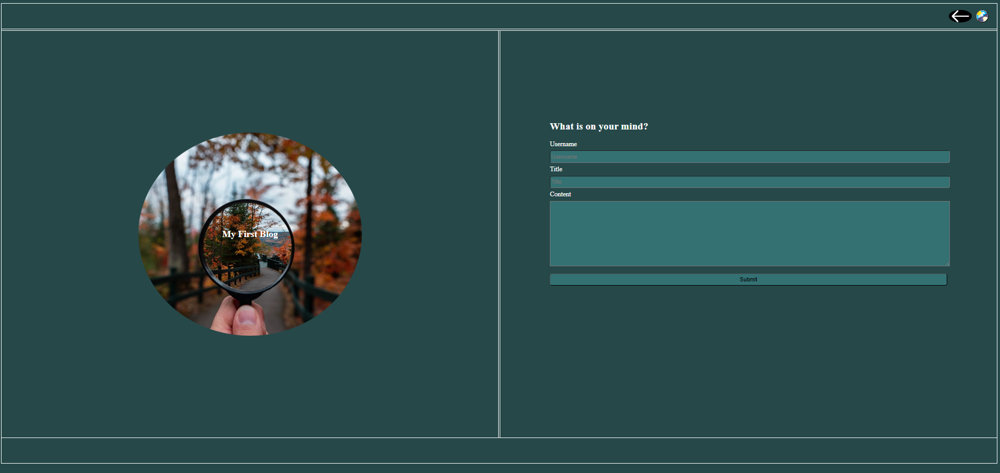
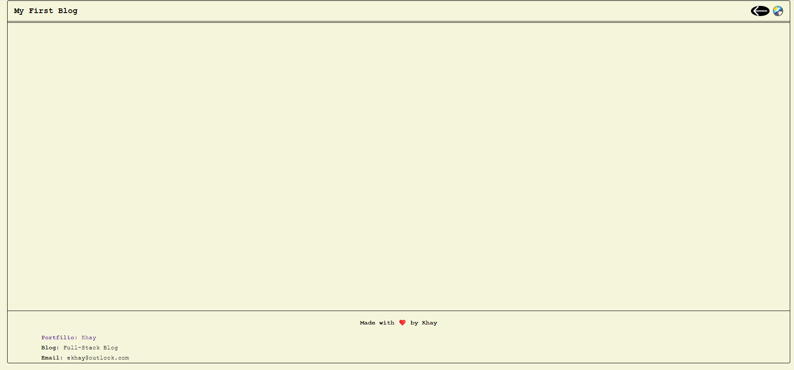
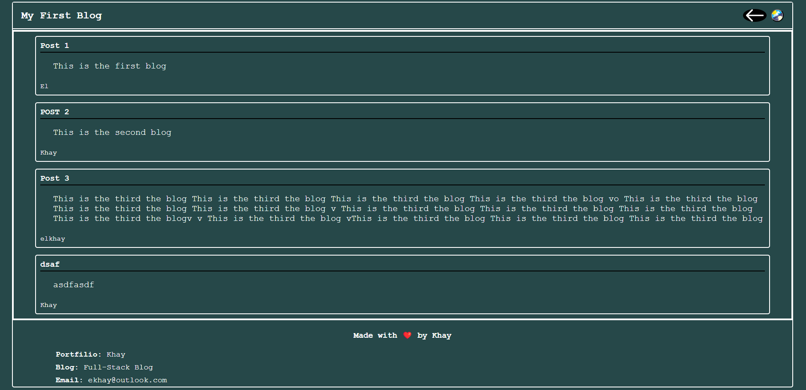

# Blog

## Description
The blog consiste of two pages. First page has a form where user can write thier user name , blog's title and the content then submit it. The blog then will be added to the blog page

## Installation

N/A

## Usage

- The blog contains 2 sections.
- Main page diplays blog icon and form that uses to submit new blogs
- Second page displays the blogs what were submited
- Header of each page diplays a navigation between pages and the backgroung mode switched button
- Footer in the blog page, display the blogs author, portfilio and email. 

## Credits

N/A

## License

Please refer to the LICENSE in the repo.

## Link to the application and screenshots
* link to the application: https://ekhay-hit.github.io/Blog/
* Screenshots of the application

